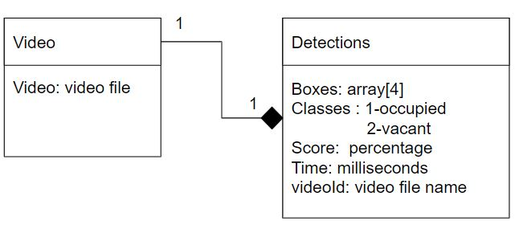

# Parking Lot Detector Web App for 360°-Camera of Cars With Database for Detections

## Database Architecture
The database follow this diagram:
 

The Detections will store the boxes which is a 4 element array; the classes which can either be 1 or 2; the score of the percentage of the prediction; Time is time of the detection in the video; and the videoId or the filename of the video.

The Detection will be dependent on the video and the video file name.

## Run the Program

In the project directory, you can run:

```
  npm start
```

Runs the app in the development mode.\


Next is, to install the http-server, if you have installed the http-server, skip this step. 
```
  npm install http-server -g
```
After that is to go to the folder ` tfjs3` and run the command below:

``` 
  http-server -c1 --cors .
```
Finally, it to refresh the [http://localhost:3000](http://localhost:3000).

## The Video
Download the [video](https://drive.google.com/drive/folders/1nCjHoFH4oSgcBYF8-my8f5V7pZ8bnAWQ?usp=sharing) and use it to test the program.

## Referces
For the parkinglot dataset.
https://cslinzhang.github.io/deepps/

